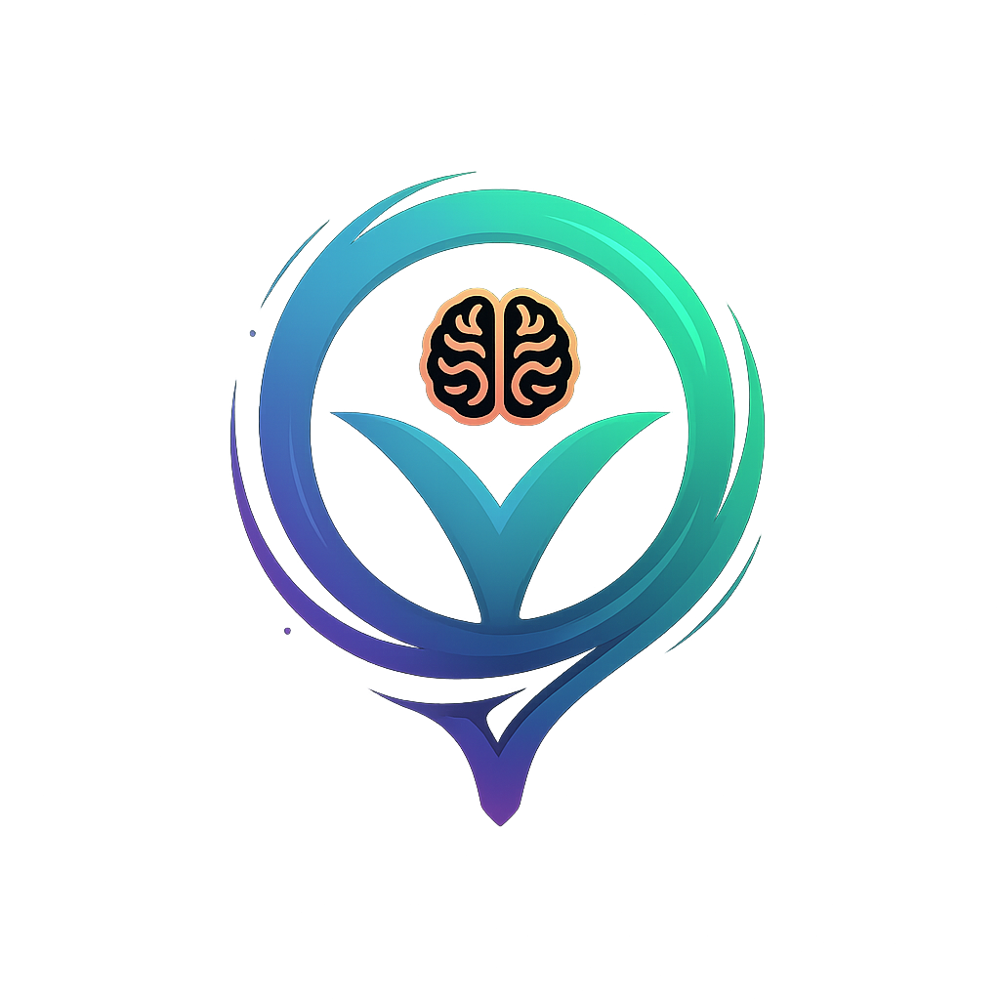

#  BotCure  - Your AI Mental Wellness Companion

> BotCure is a full-stack, real-time mental health chatbot designed to provide a safe, supportive, and interactive space for users. Powered by the MERN stack and advanced AI, it offers empathetic conversations, immediate crisis support, helpful resources, and mood-boosting games to promote mental well-being.
> 

## ✨ Features

-   🧠 **AI-Powered Chat:** Leverages the Google Gemini API to provide thoughtful, structured, and empathetic responses, acting as a supportive companion.
-   🆘 **Critical Crisis Management:** A sophisticated sentiment analysis system detects crisis-related keywords (e.g., "kill myself").
    -   **Immediate Action:** Overrides the standard AI response to provide a direct, concise message with localized helpline numbers (e.g., for India, US, UK).
    -   **Safe Resource Searching:** Prevents harmful searches by providing safe, pre-defined resources during a crisis.
-   📚 **Relevant Resource Finder:** Uses the Google Custom Search API to dynamically find and display relevant mental health resources.
    -   Finds 3 helpful articles.
    -   Finds 2 relevant YouTube videos based on the user's conversation.
-   🎮 **Mood-Booster Games:** A dedicated section with interactive games to provide a mental break and lift the user's mood.
    -   **Tic-Tac-Toe:** Play against a simple AI opponent.
    -   **Find The Pair:** A classic memory game to improve focus.
    -   **Stress Buster:** A cathartic "hit the buddy" game with interactive tools, sounds, and animations to release stress.
-   🔐 **User Authentication:** Secure login and registration system. User data (username, hashed password) is stored in a backend `.csv` file for simplicity.
-   ⚙️ **Personalized Settings:**
    -   **Theme Control:** Switch between a calming Light Mode (green shades) and a focused Dark Mode (black shades).
    -   **Voice Options:** Choose between male and female voices for text-to-speech output.
    -   **User Details:** View your username and unique User ID.
-   🗣️ **Voice Interaction:**
    -   **Voice Input:** Use your microphone to speak your messages.
    -   **Text-to-Speech:** Listen to the chatbot's responses with the click of a button.
-   📧 **Feedback System:** A built-in feedback form that uses Nodemailer and a Google App Password to send user feedback directly to the developer's email.
-   🎨 **Modern & Responsive UI:** A clean, intuitive interface inspired by leading chatbot designs, with an auto-hiding (and pinnable) sidebar for a seamless user experience.

## 💻 Technologies Used

| Category | Technology / Service                                       |
| :------- | :--------------------------------------------------------- |
| Frontend | React.js, JavaScript (ES6+), CSS3, HTML5                   |
| Backend  | Node.js, Express.js                                        |
| APIs     | Google Gemini API, Google Custom Search API, Web Speech API|
| Database | CSV File System (for simple, persistent user storage)      |
| Services | Nodemailer (for the feedback and email system)             |

## 📋 Prerequisites

Before you begin, ensure you have the following installed on your system:

-   [Node.js](https://nodejs.org/) (which includes npm)
-   A modern web browser like Chrome, Firefox, or Edge.
-   A code editor of your choice (VS Code is recommended).

## 🚀 Installation & Setup

Follow these steps to get your local development environment running.

### 1. Clone the Repository

```bash
git clone [https://github.com/your-username/BotCure.git](https://github.com/your-username/BotCure.git)
cd BotCure
```

### 2. Backend Setup

```bash
# Navigate to the backend directory
cd backend

# Install dependencies
npm install

#Create a .env file in the backend folder and add the following variables. 
#You can rename the provided .env.example to .env.
```

### backend/.env file:

```bash
# --- API Keys ---
GEMINI_API_KEY="YOUR_GEMINI_API_KEY"
GOOGLE_SEARCH_API_KEY="YOUR_GOOGLE_SEARCH_API_KEY"
SEARCH_ENGINE_ID="YOUR_SEARCH_ENGINE_ID"

# --- Email for Feedback ---
# Your Gmail address
EMAIL_USER="your-email@gmail.com" 
# Your 16-digit Google App Password
EMAIL_PASS="yourapppassword"
```

### How to get your API Keys:

-   **GEMINI_API_KEY:** Get from Google AI Studio.
-   **Google Search_API_KEY & SEARCH_ENGINE_ID:** Follow the guides to enable the Custom Search API and create a search engine.
-   **EMAIL_PASS:** This is not your regular Gmail password. It's a 16-digit Google App Password.

```bash
# Start the backend server (it will run on http://localhost:5001)
npm start
```

### 3. Frontend Setup

```bash
# Open a NEW terminal and navigate to the frontend directory
cd frontend

# Install dependencies
npm install

# Start the frontend React app (it will open automatically on http://localhost:3000)
npm start
```
You should now have the BotCure application running in your browser! 🎉

## 🧑‍💻 Developer Info
This project was developed with passion and dedication by:

-  **Name:** Yogesh Kumar H Mutt S
-  **Email:** ykhmutt0804@gmail.com
-  **GitHub:** [0YogeshKumar](https://github.com/0YogeshKumar/)
-  **LinkedIn:** [Yogesh Kumar H Mutt S](https://www.linkedin.com/in/yogesh-kumar-h-mutt-s-6b858b382/)

## 📜 License
This project is licensed under the MIT License. See the `LICENSE` file for more details.